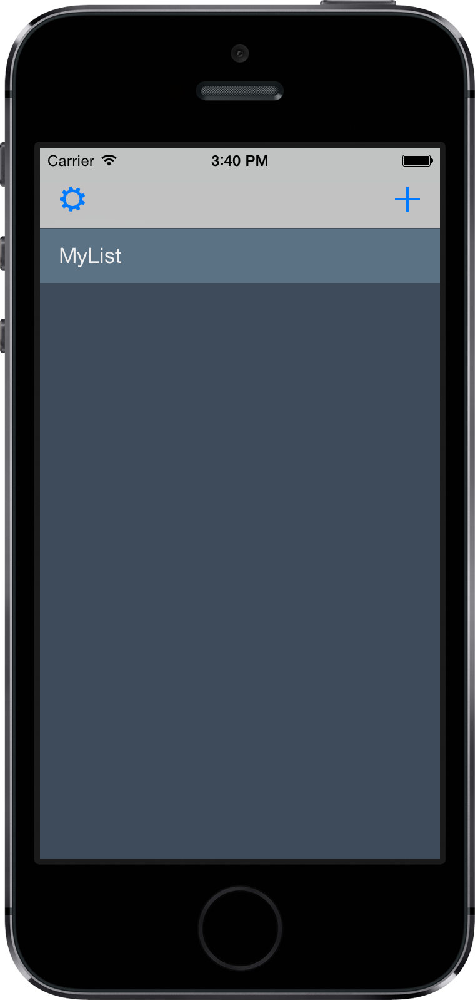

# Doer
Doer is a to-do-list app, it can manager your items. For example, you can create, delete or archieve an item with simple gesture.

##other
Doer used a third library named FMMoveTableView. Thanks the author to provide the source code.
####https://github.com/FlorianMielke/FMMoveTableView
